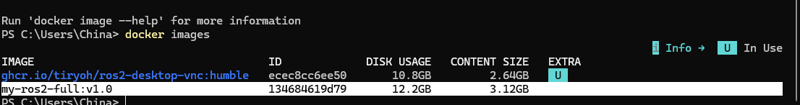
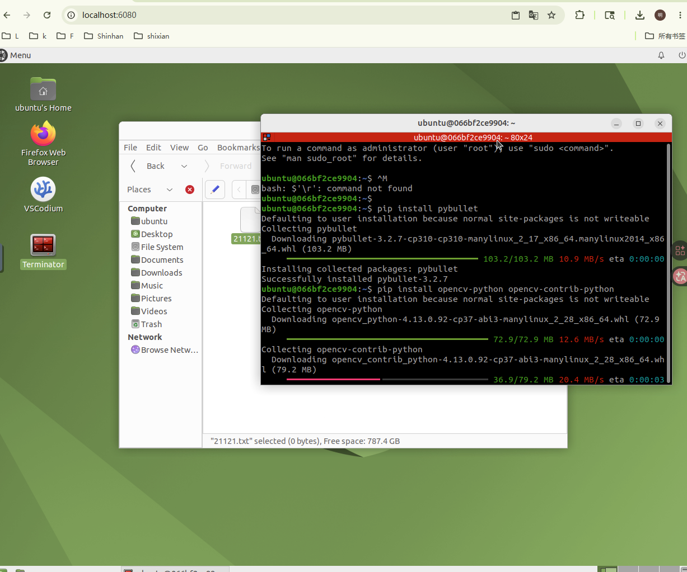

# Week 11 作业记录：Docker 进阶与 GitHub Pages 网页部署

## 1. 学习目标

- 进一步理解 Docker 镜像、容器、端口映射和环境保存。
- 将课程作业整理成 GitHub Pages 网页。
- 检查网页中的图片路径和目录链接，保证评分系统可以正常访问。

## 2. Docker 进阶理解

Docker 的核心对象：

- Image：镜像，是环境模板。
- Container：容器，是镜像运行后的实例。
- Port mapping：端口映射，让宿主机访问容器服务。
- Commit：把当前容器状态保存成新的镜像。

常用命令：

```bash
docker ps
docker images
docker stop <container_id>
docker commit <container_id> ai-robot-ros2:week11
```

## 3. GitHub Pages 部署流程

### 3.1 整理首页

首页 `README.md` 中加入每周目录，确保链接可以跳转到对应 `week*/README.md`。

### 3.2 检查图片路径

每周 README 中使用相对路径，例如：

```markdown

```

这样 GitHub 和 GitHub Pages 都可以正确显示图片。

### 3.3 Pages 发布

在 GitHub 仓库设置中开启 Pages，选择主分支作为发布来源。发布成功后，可以通过网页访问作业。

## 4. 实验结果

Docker 与 GitHub Pages 相关截图如下：




## 5. 工程检查清单

为了让 GitHub Pages 和评分系统稳定读取作业，本周按以下清单检查：

| 检查项 | 目的 | 当前处理 |
| --- | --- | --- |
| 首页目录完整 | 评分系统能找到每周作业入口 | `README.md` 包含 Week1-15 |
| 图片相对路径 | GitHub Pages 页面不丢图 | 使用 `../img/week*/...` |
| 每周 README | 每周都有目标、步骤、结果、总结 | 已按周整理 |
| 代码与结果同仓库 | 防止只有文字没有证据 | Week4/5/9/10/12/13/14 有代码 |
| 视频用 HTML 嵌入 | Pages 上直接显示播放器 | Week5/13/14 使用 `<video>` |

本周的核心不是只会打开 Pages，而是要保证作业结构可访问、可复现、可自动评价。

## 6. 核心理解

- Docker 解决“环境能不能复现”的问题。
- GitHub Pages 解决“作业能不能被稳定访问”的问题。
- 自动评分系统会检查仓库可访问性、页面内容、图片加载和每周作业完整度，所以目录和路径非常重要。

## 7. 问题与解决

- 图片不显示：优先检查文件是否已提交、大小写是否一致、路径是否正确。
- Pages 更新慢：等待 GitHub Pages 重新构建，或检查 `_config.yml`。
- 容器环境丢失：使用 `docker commit` 或 Dockerfile 记录环境。
- 页面能打开但目录缺周次：优先检查根目录 `README.md` 是否包含对应周链接。

## 8. 本周总结

本周把 Docker 环境管理和 GitHub Pages 展示连接起来，完成了课程作业从本地实验到在线展示的闭环。
