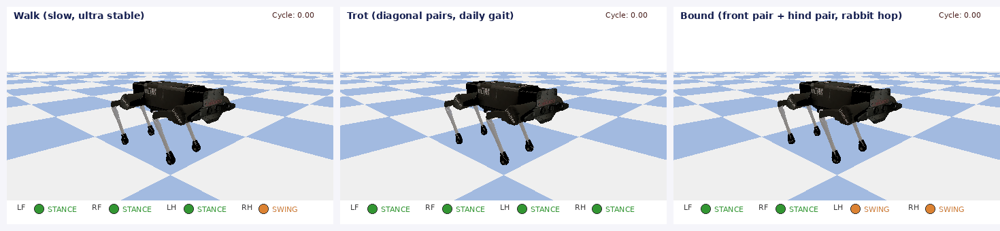
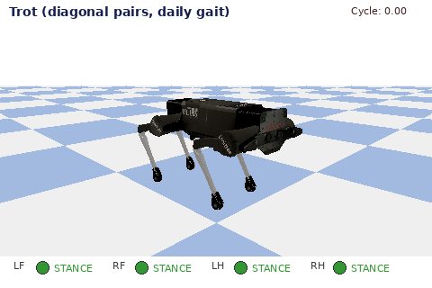
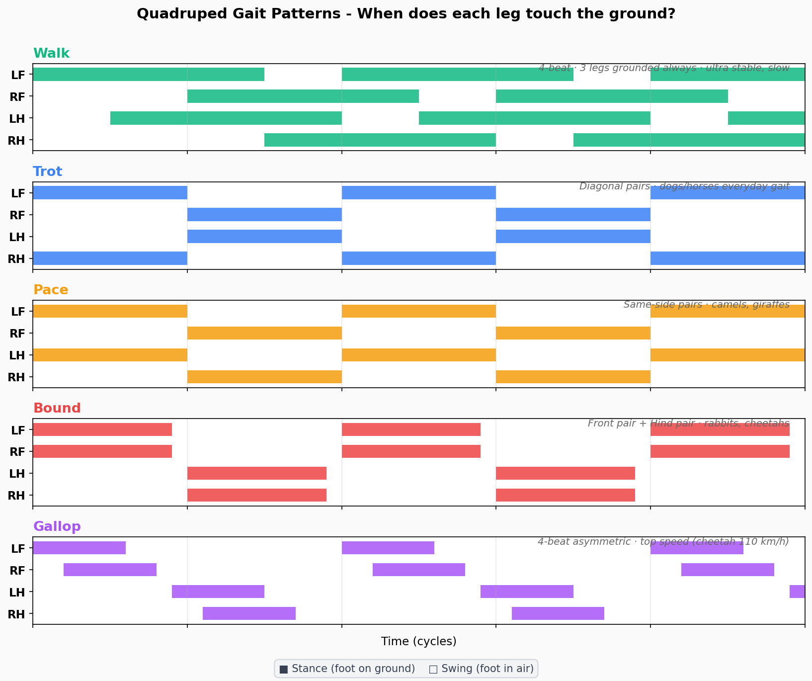
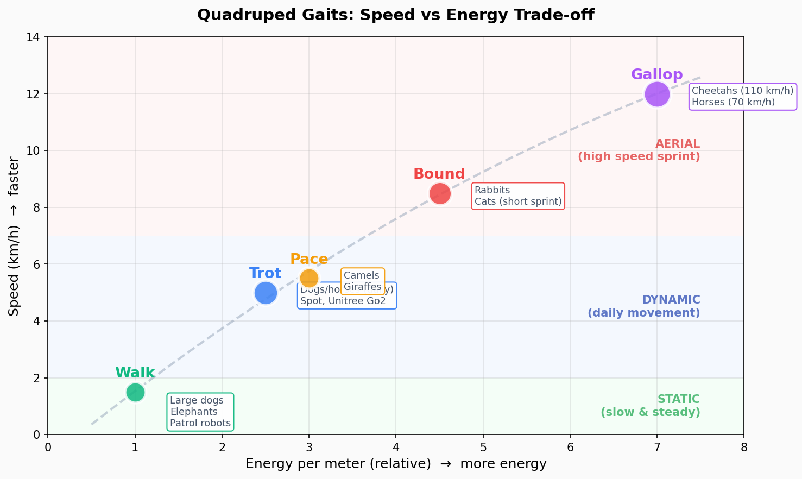
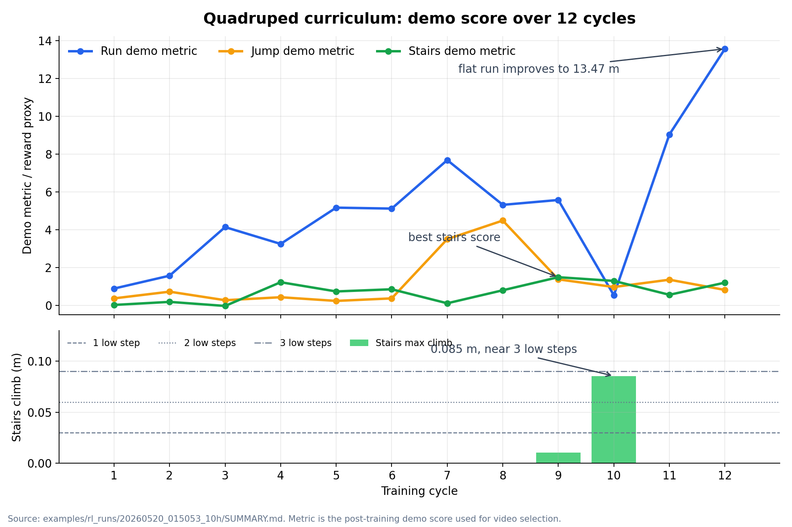

# 第 13 周：四足机器人仿真与强化学习

本仓库整理了 AI Robot 课程第 13 周讲义中的可运行演示代码、步态可视化素材、PPO 强化学习程序和预训练模型。建议学生先 fork 本仓库，再将自己的 fork 作为 Git Submodule 添加到个人作业仓库中。

## 1. 学生推荐工作流

### 1.1 Fork 第 13 周代码仓库

在 GitHub 打开：

```text
https://github.com/ai-robot-class/week13
```

点击 **Fork**，将仓库复制到自己的账号下，例如：

```text
https://github.com/<your-github-name>/week13
```

后续如果需要修改第 13 周代码，应提交到自己的 fork，而不是直接修改官方仓库。

### 1.2 在作业仓库中添加自己的 fork 作为 submodule

进入自己的作业仓库根目录：

```bash
cd <student-homework-repo>
```

添加 submodule：

```bash
git submodule add https://github.com/<your-github-name>/week12.git week12
mkdir -p reports results
git add .gitmodules week12 reports results
git commit -m "Add week13 submodule"
```

推荐作业仓库结构：

```text
student-homework-repo/
├── week13/                 # 学生 fork 后的 week13 submodule
├── reports/                # 实验报告、截图说明
├── results/                # 自己生成的视频、模型、GIF
└── README.md               # 作业说明
```

### 1.3 克隆作业仓库后初始化 submodule

如果换电脑或重新 clone 作业仓库：

```bash
git submodule update --init --recursive
```

也可以 clone 时一次性拉取 submodule：

```bash
git clone --recurse-submodules <student-homework-repo-url>
```

### 1.4 修改 week13 代码并提交

如果要修改 `week13/` 中的代码，需要先进入 submodule：

```bash
cd week12
git checkout -b my-week12-experiment
```

修改代码后，在 `week13/` 目录内提交并推送到自己的 fork：

```bash
git add quadruped_ppo_residual_stairs.py
git commit -m "Improve week13 stair climbing reward"
git push origin my-week12-experiment
```

然后回到作业仓库根目录，提交 submodule 指针和作业材料：

```bash
cd ..
git add week12 reports results
git commit -m "Submit week13 quadruped experiment"
git push
```

注意：作业仓库记录的是 `week13` submodule 的具体提交指针。只在 submodule 内提交还不够，还需要回到作业仓库提交一次 `week13` 指针更新。

## 2. 安装依赖

在作业仓库根目录或 `week13/` 目录中运行：

```bash
pip install pybullet numpy gymnasium stable-baselines3 torch opencv-python imageio matplotlib pillow
```

## 3. 快速复现最终强化学习演示

在作业仓库根目录运行：

```bash
python3 week12/quadruped_ppo_residual_stairs.py demo --task stairs --model week12/ppo_residual_stairs.zip --stair_steps 4 --step_height 0.03 --init_x 0.00 --steps 500 --gui
```

无图形界面时录制视频：

```bash
python3 week12/quadruped_ppo_residual_stairs.py demo --task stairs --model week12/ppo_residual_stairs.zip --stair_steps 4 --step_height 0.03 --init_x 0.00 --steps 500 --record results/stairs_demo.mp4
```

预期现象：四足机器人能够明显向前爬上约三阶低台阶，但尚未满足“在最终台阶上稳定站住”的严格成功标准。


## 4. 第 13 周演示代码

### 4.1 PyBullet 入门：方块自由落体

```bash
python3 week12/demos/01_pybullet_box.py
```

对应讲义：PyBullet 基础仿真示例。

### 4.2 加载 Laikago 四足机器人

```bash
python3 week12/demos/02_load_laikago.py
```

对应讲义：加载 PyBullet 自带四足机器人模型。

### 4.3 简单正弦步态

```bash
python3 week12/demos/03_sine_gait.py
```

对应讲义：用正弦函数控制关节，观察对角腿相位差。

### 4.4 Trot 步态演示

```bash
python3 week12/demos/04_trot_gait.py
```

对应讲义：更清晰的 Trot 步态生成。

### 4.5 生成步态 GIF 与图表

```bash
python3 week12/scripts/generate_gait_gifs.py
python3 week12/scripts/generate_gait_diagrams.py
```

生成结果保存在：

```text
week13/assets/gaits/
```

## 5. 步态可视化素材

三种步态对比：



Trot 步态：



步态相位图：



速度与能耗对比：



## 6. 强化学习代码与模型

```text
week13/
├── quadruped_ppo_residual_stairs.py      # PPO + residual controller 主程序
├── ppo_run_flat.zip                      # 平地跑步预训练模型
├── ppo_residual_stairs.zip               # 低台阶预训练模型
├── demos/                                # PyBullet 与步态演示代码
├── scripts/                              # GIF / 图表生成脚本
└── assets/                               # README 与讲义使用的可视化素材
```

平地跑步演示：

```bash
python3 week12/quadruped_ppo_residual_stairs.py demo --task run --model week12/ppo_run_flat.zip --steps 500 --gui
```

从低台阶预训练模型继续训练：

```bash
python3 week12/quadruped_ppo_residual_stairs.py train \
    --task stairs \
    --load_model week12/ppo_residual_stairs.zip \
    --timesteps 300000 \
    --num_envs 8 \
    --batch_size 2048 \
    --curriculum \
    --model results/my_stairs_policy.zip
```

录制自己的策略：

```bash
python3 week12/quadruped_ppo_residual_stairs.py demo \
    --task stairs \
    --model results/my_stairs_policy.zip \
    --stair_steps 4 \
    --step_height 0.03 \
    --init_x 0.00 \
    --steps 500 \
    --record results/my_stairs_demo.mp4
```

训练指标参考：



## 7. 作业报告建议

建议在 `reports/week13_report.md` 中记录：

```markdown
# Week 13 四足机器人仿真与强化学习实验报告

## 运行的演示
- PyBullet 方块自由落体：
- Laikago 加载：
- 正弦步态：
- Trot 步态：
- PPO 爬楼梯：

## 修改内容
- 修改的文件：
- 修改的奖励项或参数：
- 修改原因：

## 实验结果
- 模型文件：
- 视频文件：
- 最明显的进步：
- 仍然存在的问题：

## 反思
- 策略是否出现投机行为？
- 成功判定是否合理？
- 下一步如何改进？
```

提交作业：

```bash
git add reports results week12
git commit -m "Submit week13 quadruped simulation assignment"
git push
```

## 8. 成功判定标准

本任务中，“成功”不等同于腿部高度超过台阶，也不等同于机身短暂冲上台阶。严格成功需要同时满足：

1. 机身中心到达最终台阶区域
2. 机身保持直立
3. 至少两只脚趾稳定接触最终台阶
4. 身体、大腿、小腿不能作为支撑卡在台阶上
5. 线速度和角速度足够小
6. 连续稳定保持一段时间

当前 `ppo_residual_stairs.zip` 展示了训练带来的显著阶段性进步：机器人可以爬上约三阶低台阶；但该策略尚未达到上述严格成功标准。

## 9. 常见问题

### `week13/` 目录为空

说明 submodule 尚未初始化：

```bash
git submodule update --init --recursive
```

### 修改了 `week13/`，但作业仓库没有记录具体文件变化

这是 submodule 的正常行为。应先在 `week13/` 仓库内部提交修改，再回到作业仓库提交 submodule 指针。

### 无法打开显示窗口

使用 `--record` 参数录制视频，并省略 `--gui`。

### 训练速度较慢

PyBullet 使用 CPU 物理仿真，无法像 Isaac Gym / Isaac Lab 一样进行大规模 GPU 并行仿真。本仓库更适合教学演示、奖励函数调试和小规模实验。

## English Summary

This repository contains runnable Week 13 simulation demos, gait visualizations, PPO residual stair-climbing code, and pretrained models. Students are encouraged to fork this repository, add their fork as a Git submodule in their homework repository, modify their fork, and submit both the submodule pointer and experiment report.
111