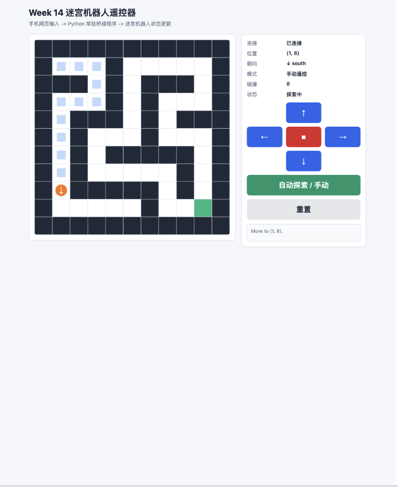

# Week 14 作业记录：手机遥控 + 局域网通信 + 仿真机器人迷宫探索

## 1. 学习目标

- 把手机网页作为机器人遥控器输入端。
- 理解 `手机 -> Tailscale / 局域网 -> WSL / Python 常驻程序 -> 仿真机器人` 的完整控制链路。
- 用一个常驻 Python 程序同时完成网络接收、状态更新、碰撞判断和迷宫探索。
- 在迷宫场景中实现前进、后退、左转、右转、停止和自动探索。

## 2. 项目方向

本次作业参考课程 Week14 的两个方向，选择一个轻量可复现的仿真实现：

- 方向 A：PyBullet 四足机器人迷宫探索
- 方向 B：turtlesim 二维迷宫探索
- 本仓库实现：二维迷宫遥控仿真，保留课程要求的手机遥控、局域网访问、单一常驻桥接程序、碰撞检测和自动探索思路

这样做的目标是先把工程链路打通，后续可以把同一套网页遥控接口迁移到 PyBullet 机器狗或 ROS2 turtlesim。

## 3. 文件说明

- [`index.html`](index.html)：手机遥控网页，包含前进、后退、左转、右转、停止、重置、BFS 自动探索按钮。
- [`server.py`](server.py)：唯一常驻桥接程序，负责网页服务、网络命令接收、机器人状态更新、碰撞处理和自动探索调度。
- [`maze.py`](maze.py)：自定义迷宫地图、起点、终点、方向、碰撞检测和邻居节点计算。
- [`explorer.py`](explorer.py)：BFS 最短路径规划，并把路径转换为机器人可执行的转向/前进命令。
- [`maze_remote_sim.py`](maze_remote_sim.py)：兼容旧入口，内部调用 `server.py`。
- [`week14.pdf`](week14.pdf)：Week14 小组报告书。
- `../img/week14/maze.mov`、`../img/week14/maze.png`：本周运行录屏和真实截图。

## 4. 系统链路

```text
手机浏览器
   |
   |  HTTP / JSON 控制命令
   v
Tailscale 或同一局域网 IP
   |
   v
Python 常驻桥接程序 server.py
   |
   |  maze.py 碰撞检测 / explorer.py BFS 自动探索 / 状态更新
   v
二维迷宫机器人仿真
```

本周特别注意“单一常驻程序”原则：网页只负责发命令，`server.py` 同时负责 HTTP 网络接收、机器人控制、碰撞检测和自动探索调度，不再额外启动第二个程序接管控制链路。

## 5. 运行方法

### 5.1 启动桥接程序

在项目根目录执行：

```bash
cd week14
python3 server.py
```

默认监听：

```text
http://0.0.0.0:8014
```

电脑本机测试：

```text
http://127.0.0.1:8014
```

### 5.2 手机访问

如果手机和电脑在同一个 Wi-Fi 或 Tailscale 网络中，先查看电脑 IP：

```bash
ifconfig
tailscale ip -4
```

然后手机浏览器访问：

```text
http://电脑IP:8014
```

页面打开后，可以使用前进、后退、左转、右转、停止按钮控制迷宫中的机器人。

如果使用历史入口，也可以执行：

```bash
python3 maze_remote_sim.py
```

该文件会转发到 `server.py`，核心逻辑仍然在评分要求的 `server.py / maze.py / explorer.py / index.html` 中。

## 6. 核心功能

### 6.1 手机遥控

遥控网页发送 JSON 命令：

```json
{"command": "forward"}
```

可用命令：

- `forward`：前进一格
- `back`：后退一格
- `left`：左转
- `right`：右转
- `stop`：停止
- `auto`：启动 BFS 自动探索模式
- `explore`：重新规划到终点的 BFS 最短路径
- `reset`：重置机器人到起点

### 6.2 迷宫碰撞检测

`maze.py` 使用二维网格保存迷宫：

- `#` 表示墙体
- `S` 表示起点
- `G` 表示终点
- 空格表示可通行区域

每次移动前，`server.py` 会调用 `maze.py` 的 `is_wall()` 和 `can_move()` 预测下一格位置。如果下一格是墙体或越界，就拒绝移动并记录碰撞次数，网页同步显示前方是否被阻挡。

### 6.3 自动探索

自动模式由 `explorer.py` 实现 BFS 最短路径规划：

1. 从机器人当前位置开始搜索。
2. 只把非墙体格子加入队列。
3. 找到 `G` 终点后回溯生成最短路径。
4. 将路径转换为 `left`、`right`、`forward` 命令队列。
5. `server.py` 后台循环逐步执行命令，让网页能看到自动探索过程。

网页会同时显示机器人实际轨迹和 BFS 计划路径，满足自动探索、碰撞处理和路径可视化记录的进阶要求。

## 7. 实验结果

本周运行录屏如下：

<video src="../img/week14/maze.mov" controls width="700"></video>


## 8. 问题与解决

- 手机打不开页面：检查手机和电脑是否在同一个 Wi-Fi 或同一个 Tailscale Tailnet。
- 页面能打开但控制无反应：确认 `server.py` 没有关闭，终端仍在运行。
- 撞墙后不移动：这是碰撞检测生效，换方向后继续探索。
- 自动探索未启动：点击 `BFS 自动探索 / 手动` 或 `重新规划最短路径`。

## 9. 后续优化

- 把 HTTP 轮询升级为 WebSocket，实时性更接近课程起始代码。
- 将二维迷宫控制接口迁移到 ROS2 turtlesim 的 `/turtle1/cmd_vel`。
- 在 BFS 基础上继续扩展 A*，加入启发式距离和更复杂障碍物。
- 在网页中增加用时、路径长度、碰撞次数和到达终点提示。
- 小组报告中补充手机访问截图、终端运行截图和分工说明。

## 10. 本周总结

Week14 的重点不是单独学习某一个算法，而是把网页、网络、桥接程序和机器人控制串成一个完整系统。本次作业完成了可运行的手机遥控迷宫仿真，并保留了自动探索和碰撞处理接口，为后续连接 PyBullet 机器狗或 ROS2 turtlesim 打好了基础。
